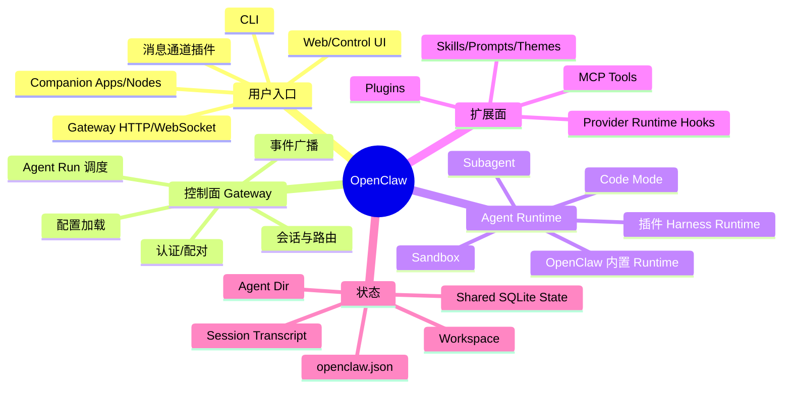
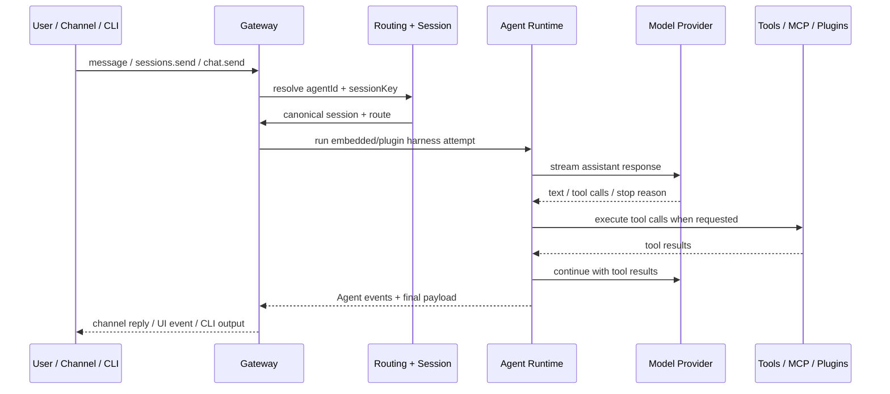
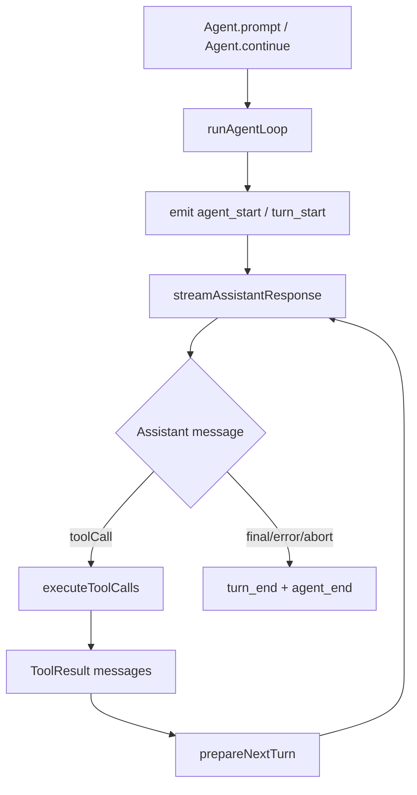
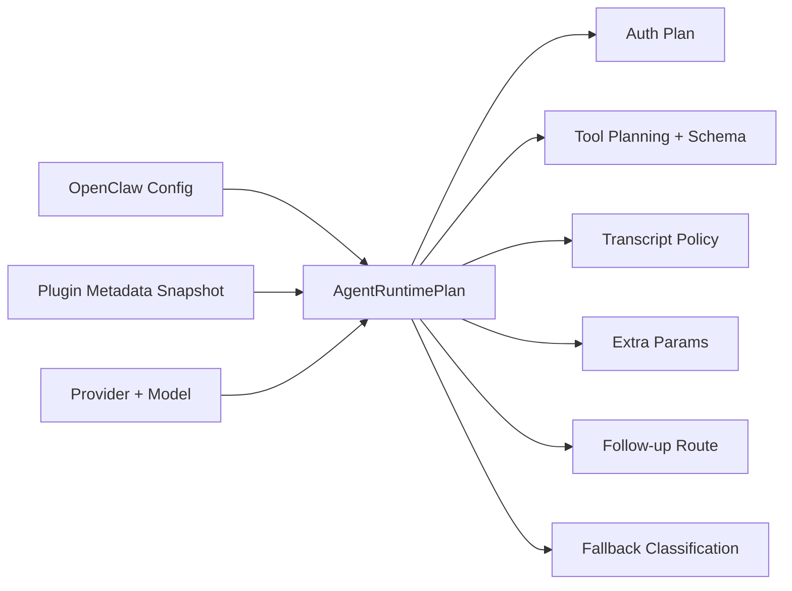
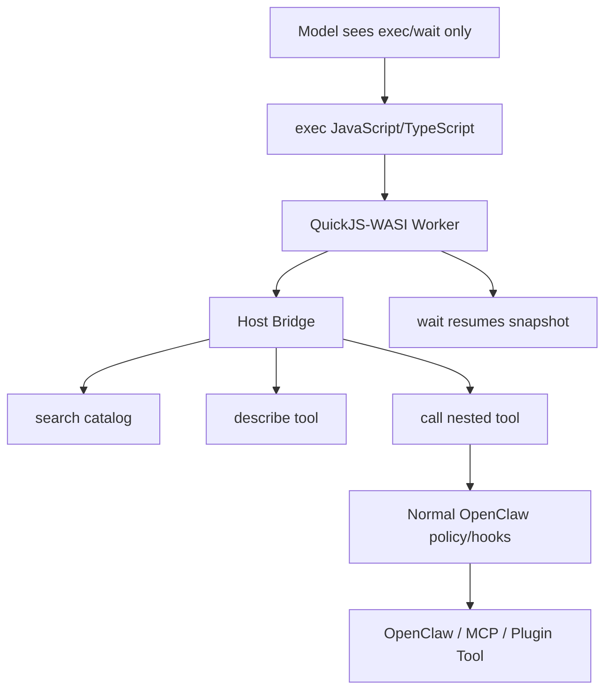

# OpenClaw System Architecture Design（SAD）思维导图

> 目的：用一份可维护的中文 SAD 笔记，快速梳理 OpenClaw 的系统边界、核心 Agent 架构、Agent 运行模式与关键代码入口。本文是面向阅读源码、二次开发、架构评审的导航图，不替代官方用户文档。

## 1. 系统定位

OpenClaw 是一个本地优先的个人 AI 助手系统。用户通过 Telegram、WhatsApp、Slack、Discord、WebChat、CLI 等通道发起请求；Gateway 作为控制面，负责通道路由、会话、Agent 运行、工具、插件、模型与事件流编排；Agent Runtime 再调用模型、工具、沙箱、MCP、插件能力完成任务。

## 2. SAD 分层视图

| 层                   | 职责                                                            | 典型代码/文档入口                                                                       |
| -------------------- | --------------------------------------------------------------- | --------------------------------------------------------------------------------------- |
| Product / Docs       | 产品说明、安装、通道与安全模型说明                              | `README.md`、`docs/`                                                                    |
| CLI / Gateway API    | `openclaw` 命令、Gateway RPC、HTTP/WebSocket 接入               | `src/cli/`、`src/gateway/`、`packages/gateway-protocol/`                                |
| Channel Layer        | 将外部消息通道映射为 OpenClaw 会话、回复、回调动作              | `src/channels/`、`extensions/*`                                                         |
| Routing / Session    | Agent 选择、会话 key、session store、active run interrupt/steer | `src/routing/`、`src/config/sessions/`、`src/gateway/server-methods/sessions.ts`        |
| Agent Runtime        | Agent loop、模型流式响应、工具调用、压缩、fallback、hooks       | `src/agents/`、`packages/agent-core/`                                                   |
| Tool / Sandbox / MCP | Tool schema、执行策略、审批、沙箱、MCP 工具编排                 | `src/agents/agent-tools*.ts`、`src/agents/sandbox/`、`src/agents/embedded-agent-mcp.ts` |
| Plugin / Provider    | 插件元数据、Provider runtime hook、Agent harness 扩展           | `src/plugins/`、`src/agents/harness/`、`src/plugin-sdk/`                                |
| Persistence          | 配置、会话、转录、共享状态、每 Agent 状态                       | `src/config/`、`src/state/`、`src/agents/agent-scope*.ts`                               |

## 3. 核心运行链路

### 3.1 从用户消息到 Agent Run

### 3.2 Gateway 会话入口

Gateway 的 `sessions.send` / `sessions.steer` 路径会校验参数、解析 session key、推断或校验 `agentId`，必要时为 Agent 主会话创建 session，然后委托到 `chat.send` 触发实际 Agent 运行。它也能在 `interruptIfActive` 时中断正在运行的会话并清理队列。

关键点：

- `agent:<id>:...` 风格 session key 是多 Agent 隔离的核心载体。
- `main` Agent 是默认 Agent；其他 Agent 可绑定通道/account 或独立 workspace。
- `sessions.steer` 用于向已有活跃/已有会话注入消息；`sessions.send` 可创建空的 Agent 主会话。

## 4. Agent 关键架构

### 4.1 Agent Core：状态机与事件流

`packages/agent-core` 提供通用 Agent 内核。`Agent` 类拥有 transcript、tool 列表、事件订阅、steering/follow-up 队列、abort/wait/reset/prompt/continue API。它不直接绑定 OpenClaw 的通道或插件，而是通过 `streamFn`、`runtime`、`beforeToolCall`、`afterToolCall`、`prepareNextTurn` 等依赖注入点被上层运行时组装。

### 4.2 Embedded Agent Runner：OpenClaw 内置运行时

`src/agents/embedded-agent-runner/run.ts` 是内置 Agent Run 的顶层编排入口。它把配置、模型选择、认证 profile、上下文压缩、工具策略、运行队列、插件 hook、fallback、delivery evidence、usage 等横切关注点组合成一次可观测的 attempt/run。

重点职责：

- 解析 runtime config、Agent scope、workspace、session key。
- 初始化 context engine、runtime plugins、provider auth、model catalog。
- 构建 runtime plan：认证、provider hook、tool schema、transcript policy、extra params、fallback outcome。
- 调用 harness selection，决定用内置 OpenClaw harness 还是插件 harness。
- 处理重试、模型 fallback、rate limit、空响应、上下文溢出、压缩后继续。
- 把运行事件写回 session/transcript，并通过 Gateway 广播。

### 4.3 Runtime Plan：一次 Attempt 的“执行计划”

`buildAgentRuntimePlan` 将一次模型调用所需的 provider/runtime 决策集中起来：provider runtime handle、认证计划、工具 schema 规范化、transcript policy、transport extra params、系统提示贡献、provider 文本变换、fallback outcome 分类等。这样内置 runner 不需要在热路径散落重复发现逻辑。

### 4.4 Harness Selection：内置与插件 Runtime 的边界

Agent harness 是 Agent Runtime 的执行适配层。选择策略：

- `openclaw`：强制使用内置 OpenClaw harness。
- 显式插件 runtime：必须存在且支持当前 provider/model；不支持则失败。
- `auto`：优先选择支持当前 provider/model 的插件 harness；没有匹配时回退到内置 OpenClaw。
- 隐式 Codex 但未注册 Codex harness 时，可降级为 OpenClaw；显式插件失败不会静默回退。

这个边界保证：插件 Runtime 失败时不会悄悄换成内置 Runtime，避免工具/安全语义漂移。

### 4.5 Tool Surface：工具、审批、沙箱与执行策略

Agent 可见工具由配置、Agent scope、channel/sender/group policy、插件、MCP、沙箱策略共同决定。OpenClaw 的工具层包含：

- 工具定义与 schema：`src/agents/agent-tools*.ts`。
- before/after tool hook：审批、策略、上下文注入、结果观测。
- 沙箱：非 main session 或受限 sender/group 可限制工具集合与文件/进程访问。
- MCP：作为工具来源合入有效工具目录；Code Mode 下通过 namespace 调用。

## 5. Agent 模式梳理

### 5.1 单 Agent 默认模式

默认安装通常只有 `main` Agent。所有未显式绑定的入口路由到默认 Agent，使用默认 workspace、模型配置、auth profile 与 session store。适合个人本地助手、CLI 调试、单用户消息通道。

### 5.2 多 Agent 隔离模式

`openclaw agents` 支持创建多个 Agent，每个 Agent 可拥有独立 workspace、agent dir、identity、skills、model/auth 选择和 channel binding。通道绑定把特定 channel/account/conversation 路由到指定 Agent。

典型用途：

- `work` Agent：工作 workspace、公司通道、受限工具。
- `ops` Agent：监控/告警通道、独立身份和 session。
- `main` Agent：个人默认助手。

### 5.3 Channel Binding / Runtime Conversation Binding 模式

通道路由会先得到默认 `ResolvedAgentRoute`，再由 configured binding 或 runtime conversation binding 改写 `sessionKey` / `agentId`。Configured binding 来自配置；runtime binding 来自运行时持久化的会话绑定记录。Cron run session 不接收实时通道流量；插件拥有的 runtime binding 由插件自己完成 handoff。

### 5.4 OpenClaw 内置 Runtime 模式

这是默认通用 Agent Runtime。它使用 OpenClaw 自己的 Agent loop、provider stream adapter、tool executor、context compaction、model fallback 与 session 写入逻辑。适合绝大多数普通聊天、工具调用、多通道助手场景。

### 5.5 插件 Harness Runtime 模式

插件可注册 Agent harness，把特定 provider/model 或 runtime id 的执行交给插件。OpenClaw 仍负责 Gateway、session、路由、配置、策略等外围控制面，但模型执行语义由插件 harness 实现。显式指定插件 runtime 时，未安装/不支持会失败；`auto` 才能在无匹配插件时使用内置 OpenClaw。

### 5.6 Code Mode 模式

Code Mode 是 OpenClaw generic runtime 的实验性工具编排模式。启用后，模型可见工具缩减为 `exec` 和 `wait`；模型在 QuickJS-WASI guest runtime 中写 JavaScript/TypeScript，通过隐藏工具目录搜索、描述、调用真实 OpenClaw/MCP/client tools。它改变的是“模型可见编排界面”，不是 provider、auth、channel、tool policy 或工具实现。

### 5.7 Subagent / Spawn 模式

Subagent 是从当前运行中派生出的子 Agent 会话，用于并行或委派任务。其运行仍落在 Agent/session/harness 体系内，但会带有 parent/spawn metadata、能力约束、session key 与工具策略。适合把大型任务拆成互不冲突的工作单元。

### 5.8 Sandboxed Agent 模式

安全模型允许对非 main session、group/channel、sender 或特定 Agent 使用沙箱工具策略。沙箱模式限制工具和文件/进程能力，避免公开或半公开通道获得主机级权限。典型默认策略是 main session 保持强能力，而 non-main 或不可信来源只允许安全工具集合。

### 5.9 CLI / Foreground / Daemon 模式

运行形态上，Gateway 可作为 daemon 常驻，也可 foreground/debug 运行。CLI 的 `openclaw agent --message ...`、`openclaw message send ...`、`openclaw gateway ...` 是开发和运维入口。形态不同，但核心链路仍是 Gateway -> Session -> Agent Runtime。

## 6. 核心数据与控制对象

| 对象                     | 含义                              | 设计关注点                                                        |
| ------------------------ | --------------------------------- | ----------------------------------------------------------------- |
| `agentId`                | Agent 隔离单元，如 `main`、`work` | 决定 workspace、identity、model/auth、skills、session scope       |
| `sessionKey`             | 会话路由 key                      | 多 Agent、global/main/session 兼容，active run abort/steer 的索引 |
| `workspaceDir`           | Agent 工作目录                    | 技能、文件工具、身份文件、用户项目上下文                          |
| `agentDir`               | Agent 状态目录                    | auth profiles、agent-scoped runtime state                         |
| `AgentRuntimePlan`       | Attempt 执行计划                  | 集中 provider/auth/tool/transcript/transport/outcome 决策         |
| `AgentHarness`           | Runtime 执行适配                  | 内置 OpenClaw 或插件 runtime 的分派边界                           |
| `PluginMetadataSnapshot` | 插件能力快照                      | 进程稳定元数据，避免热路径重复扫描                                |
| `ToolCatalog`            | 有效工具目录                      | 受配置、插件、MCP、策略、Code Mode 影响                           |

## 7. 关键源码阅读路径

建议按以下顺序阅读：

1. 产品与概念：`README.md`、`docs/agent-runtime-architecture.md`、`docs/openclaw-agent-runtime.md`、`docs/cli/agents.md`、`docs/reference/code-mode.md`。
2. Gateway 会话入口：`src/gateway/server-methods/sessions.ts`、`src/gateway/server-chat.ts`。
3. Agent Core：`packages/agent-core/src/agent.ts`、`packages/agent-core/src/agent-loop.ts`。
4. 内置 Runner：`src/agents/embedded-agent-runner/run.ts`、`src/agents/embedded-agent-runner/run/*.ts`。
5. Runtime Plan 与 Harness：`src/agents/runtime-plan/build.ts`、`src/agents/harness/selection.ts`、`src/agents/harness/builtin-openclaw.ts`。
6. 工具与模式：`src/agents/agent-tools*.ts`、`src/agents/code-mode.ts`、`src/agents/sandbox/`、`src/agents/embedded-agent-mcp.ts`。
7. 插件与元数据：`src/plugins/plugin-metadata-snapshot.ts`、`src/agents/runtime-plugins.ts`、`src/plugin-sdk/`。
8. Channel routing：`src/channels/plugins/binding-routing.ts`、`src/routing/`。

## 8. 架构风险与维护原则

- 核心保持 plugin-agnostic：插件专属策略、认证、默认值应留在插件或 SDK seam，不进入 core 热路径。
- Runtime 热路径避免重复发现：插件 metadata、provider/runtime、工具目录应在生命周期边界准备好。
- 多 Agent 隔离优先：新增能力需要明确它属于 Agent、session、workspace、provider 还是 channel。
- 安全默认值不能被 convenience fallback 稀释：显式插件 runtime、工具策略、沙箱失败应尽量 fail closed。
- Code Mode 不应绕过工具策略：nested tool call 必须继续走 OpenClaw 正常执行、审批、hooks、审计路径。
- Docs 与配置同步：新增 Agent 模式、配置项、通道能力时，应同步 CLI/docs/schema/help 与测试。

## 9. 一句话总结

OpenClaw 的 Agent 架构可以理解为：Gateway 负责“谁在什么通道的哪个会话里说话”，Agent Runtime 负责“用哪个模型和工具如何完成任务”，Plugin/Harness/Code Mode/Sandbox/Subagent 则是在不破坏这条主链路的前提下扩展执行语义、工具表面与安全边界。
